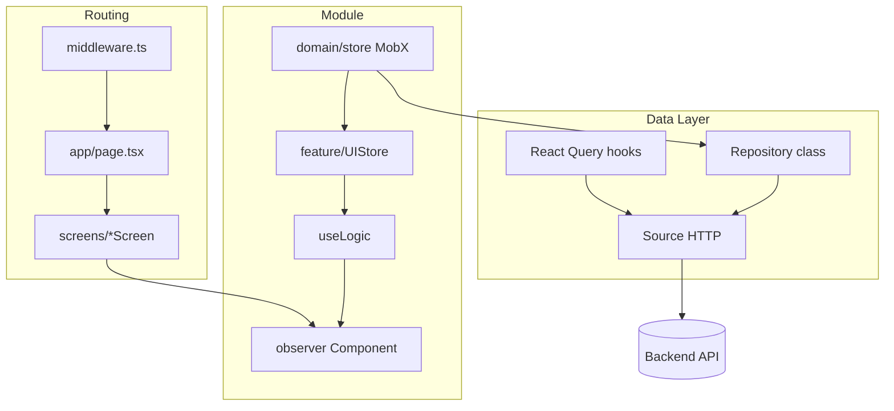

# Аудит архитектуры postfire_frontend

> **Переносимый стандарт (целевая модель):** см. `FRONTEND_ARCHITECTURE_GUIDE.md` в корне репозитория.  
> Этот файл — детальный аудит **источника** (postfire); GUIDE — что брать в новые проекты.

**Дата:** 31 мая 2026  
**Цель:** зафиксировать слои, паттерны и соглашения проекта для переноса в другие фронтенды и возможной модернизации.

---

## 1. Краткое резюме

Проект — **Next.js 16 App Router** SPA с **гибридным state management**: **MobX** для оркестрации и форм/onboarding, **TanStack React Query** для серверного кэша чтения/мутаций. Архитектура **многослойная и feature-modular**:

```
HTTP Request → middleware (auth/onboarding) → app/page.tsx → Screen → Module (domain + feature) → shared UI
                                                      ↓
                                              data (sources + repositories)
```

Ключевой повторяемый паттерн в UI: **`observer` + UIStore (MobX) + useLogic (hook) + CSS Modules**.

---

## 2. Стек технологий

| Категория | Технология |
|-----------|------------|
| Framework | Next.js 16 (`output: "standalone"`, webpack alias `@` → `src`) |
| UI | React 19, CSS Modules, частично MUI 7 + Emotion |
| State | MobX 6 + mobx-react-lite, TanStack Query 5 |
| Forms | react-hook-form |
| HTTP | axios (`httpApiClient` в `shared/config`) |
| i18n | next-intl 4 (cookie `locale`, без префикса в URL) |
| Analytics | PostHog, Google Analytics |
| Observability | Sentry (`withSentryConfig`) |
| Charts | recharts, @mui/x-charts |
| Уведомления | react-hot-toast |
| Качество | TypeScript strict, ESLint 9, husky + lint-staged, `precommit-check` (tsc + eslint) |

**Тесты:** unit/e2e тестов в репозитории **нет**.

---

## 3. Структура каталогов `src/`

```
src/
├── app/              # Next.js routes, layout, providers, error boundaries
├── screens/          # Page-level composition (client), analytics glue
├── modules/          # Feature domains (domain/ + feature/)
├── data/             # sources (HTTP) + repositories (MobX + React Query hooks)
├── shared/           # UI kit, config, utils, constants, hooks, types
├── i18n/             # next-intl request config
└── middleware.ts     # Auth + onboarding route guards
```

Корневой alias: `@/*` → `./src/*`.

Словари: `messages/en.json`, `messages/es.json` (вне `src/`).

---

## 4. Слои архитектуры

### 4.1. `app/` — маршрутизация и shell

**Ответственность:**
- Определение URL (`page.tsx`, динамические сегменты)
- Корневой `layout.tsx`: шрифты, `NextIntlClientProvider`, `ClientProviders`, оболочка `Layout` из modules
- `not-found.tsx`, `error.tsx`, `global-error.tsx`
- Провайдеры: PostHog, Notify (toast), React Query, ErrorBoundary

**Паттерн page:**
```tsx
// Тонкий Server Component — только импорт Screen
import { HomeScreen } from "@/screens";
export default async function HomePage() {
  return <HomeScreen />;
}
```

**ClientProviders (порядок снаружи внутрь):**
PostHog → Notify → QueryClient → ErrorBoundary → children

**React Query defaults:** `refetchOnMount/WindowFocus/Reconnect: false`, `retry: 0`.

---

### 4.2. `screens/` — композиция страницы

**Ответственность:**
- Клиентская обёртка (`"use client"`) над feature-модулем
- Page-level analytics (`PostHogPageView`, `withIdentifiedUser`)
- Стили экрана (`*.module.css`)
- Иногда собственный `UIStore` / `useParams` (например `PersonaScreen`, `PollsScreen`)

**Не содержит:** бизнес-логику API, сложные формы — это в `modules/`.

**Экспорт:** barrel `screens/index.ts` (опечатка в папке: `HomeSreen`).

---

### 4.3. `modules/` — feature-модули

**11 модулей:** ActionPlan, Auth, Calculator, GetHelp, Home, Layout, Library, PageError, Polls, Registration, User.

**Структура модуля (стандарт):**
```
ModuleName/
├── index.ts           # export * from domain + feature
├── domain/
│   ├── store/         # MobX singleton (API через repositories)
│   ├── types/
│   ├── constants/
│   └── utils/
└── feature/
    ├── ModuleName.tsx # оркестратор или главный UI
    ├── SubFeature/
    │   ├── Component.tsx      # observer()
    │   ├── Component.module.css
    │   ├── UIStore/           # опционально — фасад над domain store
    │   └── useLogic/          # presentation logic hook
    └── index.ts
```

**Исключения:**
- `Layout` — только `feature/` (общий header/footer)
- `PageError` — один компонент без domain
- `Home/domain` — в основном constants

**Domain store (MobX):**
- Singleton через статический `instance` в constructor или экспорт `authStore`
- `makeAutoObservable(..., { autoBind: true })`
- Вызовы `*Repository` из `@/data`, обработка ошибок через `errorsService` + `toastService`
- Cross-module: stores импортируют друг друга (например `AuthStore` → `UserStore`)

**UIStore (feature-level MobX):**
- Фасад: делегирует методы/геттеры в domain store (иногда несколько stores)
- `createUIStore()` + `useState(createUIStore)` — инстанс на mount компонента
- ~50 UIStore по проекту; не на каждом компоненте

**useLogic:**
- Кастомный хук: `useLogic(store: UIStore | DomainStore, ...args)`
- Содержит: react-hook-form, router, i18n, effects, локальный state, GA
- ~35 useLogic-хуков; всегда папка `useLogic/` с `index.ts`

**Компонент (типовой цикл):**
```tsx
export const CodeForm = observer(() => {
  const [store] = useState(createUIStore);
  const { control, onSubmitForm, isLoading, t } = useLogic(store);
  return <form className={styles.form} onSubmit={onSubmitForm}>...</form>;
});
```

**Стили:** преимущественно `*.module.css`; MUI `styled`/`sx` — точечно в shared и Calculator/Layout.

---

### 4.4. `data/` — доступ к API

**Два уровня:**

| Уровень | Роль | Кто использует |
|---------|------|----------------|
| **sources** | Объект с HTTP-методами, `*NetworkDTO`, возвращает `AxiosResponse` | React Query hooks **напрямую** |
| **repositories** | Класс-обёртка, unwrap `res.data`, singleton | MobX domain stores |

**Структура source:**
```
sources/userSource/
├── userSource.ts
├── dto.ts
└── index.ts
```

**Структура repository:**
```
repositories/UserRepository/
├── UserRepository.ts
├── dto.ts              # алиасы / unwrap NetworkDTO
├── constants/queryKeys.ts
├── hooks/
│   ├── useUserInfoQuery.ts
│   └── useUpdateUserMutation.ts
└── index.ts
```

**DTO-конвенции:**
- Source: `*NetworkDTO`, сырой контракт API
- Repository: `*DTO`, часто `type X = YNetworkDTO` или `Unwrapped["data"]`
- Shared: `ResponseWithData<T>`, `ApiError`

**React Query hooks:**
- Именование: `use{Entity}Query`, `use{Action}Mutation`
- `queryKey`: `[QUERY_KEYS.entity, accessToken]` — инвалидация при смене пользователя
- `staleTime`: `DEFAULT_CACHE_LIFETIME_MS` (30 с)
- Mutations: `refetchQueries` или `invalidateQueries` в `onSuccess`
- Ошибки в hooks **не обрабатываются** — уходят в UI

**Repositories без hooks:** Auth, Calculator, GetHelp (только class + dto).

**Важная особенность:** дублирование пути к API — hooks → sources, stores → repositories → sources. Единая точка HTTP, но два фасада потребления.

---

### 4.5. `shared/` — общая инфраструктура

**Barrel:** `shared/index.ts` → styles, ui, hooks, constants, config, utils, types.

| Подпапка | Содержимое |
|----------|------------|
| `config/` | `axios.ts` (interceptors, refresh, tokens), `middlewareUtils.ts` |
| `constants/` | `APP_ROUTES`, regex, enums, cache lifetime, images |
| `utils/` | cookieService, errorsService, toastService, logout, postHog, formatters |
| `ui/` | Button, Typography, Dialog, form controls (ControlledInput, OTP, Autocomplete…), icons |
| `hooks/` | useLocale, useDialog, useToggle, useCountdownTimer |
| `types/` | TokensPayload, ApiError |

**HTTP client:**
- Request: Bearer + `Accept-language` из cookie
- Response: auto-refresh на 401, retry с `_retry`
- Без refresh на protected routes → logout + redirect `/auth`

---

## 5. Auth и onboarding

### Middleware (`src/middleware.ts`)

1. **Полный доступ:** `access_token` + `currentStep === COMPLETED` → все маршруты, кроме pre-public (`/registration`, `/auth`, `/polls/auth`, `/persona`) → редирект на `/`
2. **Нет token:** пропуск `/auth`; попытка refresh; иначе → `/auth`
3. **Token есть, onboarding не завершён:** `checkPathAccess()` по `currentStep` cookie

| CurrentStep | Разрешённый маршрут |
|-------------|---------------------|
| NAME, WELCOM, TERMS, ADDRESS | `/registration` |
| AUTH | `/polls/auth` |
| PERSONA, PERMIS | `/persona` |
| COMPLETED | без ограничений |

### Клиент

Дублирование логики refresh в axios interceptors. Маршруты централизованы в `APP_ROUTES`.

---

## 6. i18n

- **next-intl**, locale из cookie `locale` (default `en`)
- **Нет** `[locale]` в URL — смена языка: cookie + `location.reload()`
- Сервер: `getLocale()`, `getMessages()` в layout
- Клиент: `useTranslations("Namespace")`
- API: заголовок `Accept-language` синхронизирован с cookie

---

## 7. Поток данных (сводная схема)



---

## 8. Соглашения и конвенции

### Именование

| Сущность | Паттерн |
|----------|---------|
| Модуль | PascalCase: `ActionPlan` |
| Feature UI | PascalCase по назначению: `CodeForm`, `TaskContent` |
| Store class | `{Name}Store`, singleton: `{name}Store` |
| Query keys | `QUERY_KEYS`, `PHASES_QUERY_KEYS` (SCREAMING_SNAKE значения) |
| DTO source | `*NetworkDTO` |
| DTO repo | `*DTO` |
| Routes | `APP_ROUTES.{name}.path` / `.getRoutePath(...)` |

### Файлы

- Каждая папка с публичным API — `index.ts` (barrel re-export)
- Интерактивный UI — `"use client"`
- Server Components — только тонкие `page.tsx` и layout

### Импорты

- Абсолютные: `@/modules`, `@/data`, `@/shared`, `@/screens`
- Cross-module stores — прямые импорты между модулями (связанность допустима)

### Качество кода

- ESLint: `unused-imports`, `@typescript-eslint/no-unused-vars`
- Нет Server Actions (`"use server"` не используется)
- README — дефолтный create-next-app, **не описывает** внутреннюю архитектуру

---

## 9. Аудит: сильные стороны

1. **Чёткое разделение слоёв** page → screen → module — предсказуемая навигация по кодовой базе.
2. **Повторяемый UI-паттерн** UIStore + useLogic + observer — легко тиражировать в новых фичах.
3. **Разделение domain/feature** внутри модуля — бизнес-состояние отделено от presentation.
4. **Единый HTTP-клиент** с refresh, i18n header, централизованными ошибками.
5. **Типизированные DTO** с явным слоем Network vs Domain.
6. **Централизованные маршруты** и middleware для onboarding flow.
7. **Design system** в `shared/ui` — переиспользуемые controlled-компоненты для форм.

---

## 10. Аудит: риски и технический долг

| # | Проблема | Влияние | Рекомендация при миграции |
|---|----------|---------|---------------------------|
| 1 | **Два пути к API** (hooks→source vs store→repository→source) | Расхождение логики, дублирование | Унифицировать: hooks вызывают repository или один data-access слой |
| 2 | **MobX + React Query без явных границ** | Два источника truth для одних сущностей | Правило: RQ = server cache read/mutations; MobX = wizard/UI-only state |
| 3 | **Singleton stores с cross-imports** | Сложность тестов, скрытые зависимости | DI или context для новых модулей |
| 4 | **Нет тестов** | Регрессии при рефакторинге | Минимум: hooks + critical paths middleware/utils |
| 5 | **sources помечены `"use client"`** | Лишнее для чистого HTTP | Убрать directive где не нужен |
| 6 | **Опечатки** (`HomeSreen`, `InfoFinaly`, `FinkCaptainLink`) | Путаница при поиске | Исправить при переносе |
| 7 | **Смешение CSS Modules и MUI styled** | Два стилевых мира | Выбрать один primary (CSS Modules + токены) |
| 8 | **README не документирует архитектуру** | Onboarding новых разработчиков | Ссылка на этот документ |
| 9 | **Ошибки mutations не в data layer** | Дублирование toast в каждом useLogic/store | Опциональный global mutation error handler |
| 10 | **Перезагрузка страницы при смене locale** | UX | next-intl router refresh без full reload |
| 11 | **AuthStore singleton через return в constructor** | Нестандартный паттерн MobX | `export const authStore = new AuthStore(...)` |
| 12 | **Не все repositories имеют hooks** | Непоследовательность | Документировать когда class-only vs hooks |

---

## 11. Чеклист переноса архитектуры в другой проект

### Фаза 0 — инфраструктура

- [ ] Next.js App Router + alias `@/` → `src/`
- [ ] `shared/config/axios.ts` + cookie tokens + interceptors
- [ ] `shared/constants/routes.ts` (`APP_ROUTES`)
- [ ] `middleware.ts` + `middlewareUtils.ts` (под свой onboarding)
- [ ] Providers: QueryClient, Toast, ErrorBoundary, Analytics
- [ ] next-intl + `messages/{locale}.json` + cookie locale
- [ ] ESLint + husky + `typecheck` в pre-commit

### Фаза 1 — data layer

- [ ] `src/data/sources/{domain}Source/` + `dto.ts`
- [ ] `src/data/repositories/{Domain}Repository/` + class + `dto.ts`
- [ ] `constants/queryKeys.ts` для доменов с React Query
- [ ] Hooks: `use*Query`, `use*Mutation` с `staleTime` и invalidate/refetch
- [ ] Shared types: `ResponseWithData`, `ApiError`

### Фаза 2 — shared UI

- [ ] Barrel `shared/index.ts`
- [ ] Form primitives: ControlledInput, ControlledOTP, Autocomplete, Radio, Checkbox
- [ ] errorsService, toastService, cookieService

### Фаза 3 — modules

Для каждого бизнес-домена:

- [ ] `modules/{Name}/domain/store/{Name}Store.ts` (MobX singleton)
- [ ] `domain/types`, `constants`, `utils`
- [ ] `feature/{Name}.tsx` + подфичи
- [ ] Паттерн: `UIStore` + `useLogic` + `observer` + `*.module.css`
- [ ] `modules/{Name}/index.ts`

### Фаза 4 — screens + app

- [ ] `screens/{Name}Screen/` — glue + analytics
- [ ] `app/{route}/page.tsx` — только `<Screen />`
- [ ] `screens/index.ts`, `modules/index.ts`, `data/index.ts`

### Фаза 5 — качество

- [ ] Зафиксировать правила: когда MobX vs React Query
- [ ] Добавить тесты на middleware, axios utils, критичные hooks
- [ ] Обновить README со ссылкой на архитектурный документ

---

## 12. Предложения по модернизации (без смены парадигмы)

1. **Унифицировать data access:** repositories как единственная точка для hooks и stores.
2. **Зафиксировать ADR** (Architecture Decision Records) для MobX vs RQ.
3. **Colocation query keys** рядом с hooks + factory `queryKeys.user.detail(id)`.
4. **Zod/Yup** для валидации форм и sync с DTO.
5. **Storybook** для `shared/ui`.
6. **Исправить опечатки** в именах папок/компонентов.
7. **Документировать** onboarding steps enum рядом с middleware.

---

## 13. Карта модулей и маршрутов

| Маршрут | Screen | Module(s) |
|---------|--------|-----------|
| `/` | HomeScreen | Home |
| `/auth` | AuthScreen | Auth |
| `/registration` | RegistrationScreen | Registration |
| `/polls/[id]` | PollsScreen | Polls |
| `/persona` | PersonaScreen | Polls, Registration (onboarding) |
| `/profile/[id]` | ProfileScreen | User |
| `/plan`, `/plan/phase/*`, `/plan/step/*` | ActionPlanScreen, PhaseScreen, TaskScreen | ActionPlan |
| `/library` | LibraryScreen | Library |
| `/calculator` | CalculatorScreen | Calculator |
| `/help` | HelpScreen | GetHelp |
| — | ErrorScreen, NotFoundScreen | PageError |

Оболочка всех страниц: `modules/Layout` (Header, Main, Footer, LanguageSwitcher).

---

## 14. Заключение (текущее состояние postfire)

**postfire_frontend** — прагматичная feature-modular архитектура с сильным UI-паттерном и незакрытыми правилами data/state. Разделы **15–22** — целевая модель и практический пакет для **развития архитектуры в другом проекте** (и обратного переноса улучшений сюда).

---

## 15. Целевые правила архитектуры (закрытие пробелов)

Эти правила **не полностью реализованы** в postfire — это **целевой эталон** при выравнивании нового проекта.

### 15.1. MobX vs React Query

| Ответственность | Инструмент | Примеры |
|-----------------|------------|---------|
| Серверные данные, кэш, refetch, списки/детали с API | **React Query** | `useUserInfoQuery`, фазы/шаги плана, закладки |
| Многошаговый wizard, UI-only state, флаги экранов | **MobX (domain store)** | registration flow, `isCode` в auth |
| Локальная привязка UI к store формы | **MobX (UIStore)** | делегирование в domain store, без дублирования API |
| Форма: значения, touched, errors | **react-hook-form** в `useLogic` | не дублировать поля формы в MobX |
| Синхронизация после mutation | **React Query** `invalidateQueries` / `refetchQueries` | не копировать ответ API в MobX «навсегда» |

**Запрещено:** хранить одну и ту же сущность и в MobX, и в RQ без явной причины (исключение — краткий optimistic UI до `onSuccess`).

### 15.2. Единая точка доступа к API (целевая)

```
UI / useLogic
    → React Query hook ──┐
    → MobX store ────────┼──→ Repository (class) ──→ Source ──→ httpApiClient
```

- **Source** — только HTTP, типы `*NetworkDTO`, без UI-логики.
- **Repository** — единственный публичный API для домена: unwrap `data`, маппинг DTO.
- **Hooks** вызывают **repository**, не source напрямую (отличие от текущего postfire).
- **Store** вызывает только **repository**.

### 15.3. Границы импортов между слоями

| Слой | Может импортировать | Не может |
|------|---------------------|----------|
| `app/` | `screens`, `shared`, провайдеры | `modules/*/feature` напрямую (только через Screen) |
| `screens/` | `modules`, `shared` | `data/sources` напрямую |
| `modules/feature/` | свой `domain`, `shared`, `@/data` (dto, hooks) | чужой `modules/*/domain/store` без необходимости* |
| `modules/domain/` | `@/data` repositories, `shared` utils | React components, `useLogic` |
| `data/` | `shared/config`, `shared/types` | `modules`, `screens`, React |
| `shared/` | только `shared` | `modules`, `data`, `app` |

\* Cross-module store — допустим для onboarding; новые связи фиксировать в ADR (раздел 18).

### 15.4. Ошибки и уведомления

| Слой | Поведение |
|------|-----------|
| axios interceptors | 401 refresh, redirect logout, конфигурационные ошибки |
| Repository / mutation `onError` (целевое) | опциональный global handler в QueryClient |
| MobX store | `toastService` + `errorsService.getApiErrorMessage` для команд пользователя |
| `useLogic` | не дублировать toast, если store уже обработал |

Формат API-ошибки (если бэкенд совместим):

```ts
type ApiError = {
  error: { category: string; code: string; message: string; fields?: ... };
};
type ResponseWithData<T> = { code: number; data: T; error: string; ... };
```

### 15.5. Query keys (целевой формат)

```ts
export const userKeys = {
  all: ["user"] as const,
  info: () => [...userKeys.all, "info", getAccessToken()] as const,
  captainLink: () => [...userKeys.all, "captain-link", getAccessToken()] as const,
};
```

- Токен/tenant в ключе — только если кэш должен сбрасываться при смене сессии.
- Mutations инвалидируют **конкретные** ключи, не `["user"]` целиком без нужды.

### 15.6. Новая фича — Definition of Done

- [ ] Модуль: `domain/` + `feature/` + barrels `index.ts`
- [ ] Screen (если новый маршрут) + тонкий `app/.../page.tsx`
- [ ] DTO: `*NetworkDTO` в source, `*DTO` в repository
- [ ] Query/mutation или store — по таблице 15.1, не оба для одних данных
- [ ] `useLogic` + `observer` + CSS Module
- [ ] Маршрут в `APP_ROUTES` (+ middleware, если защищённый)
- [ ] i18n ключи в `messages/*.json`
- [ ] Нет unused imports (eslint)
- [ ] ADR, если нарушены границы импортов или добавлен cross-module store

---

## 16. Эталонные файлы postfire (для копирования структуры)

При переносе указывайте AI или разработчику **конкретные образцы**, а не только этот MD.

| Назначение | Путь в postfire_frontend |
|------------|--------------------------|
| Тонкий page | `src/app/page.tsx`, `src/app/auth/page.tsx` |
| Screen + analytics | `src/screens/HomeSreen/HomeScreen.tsx` |
| Screen со store | `src/screens/PersonaScreen/PersonaScreen.tsx` |
| Domain store + repository | `src/modules/Auth/domain/store/AuthStore.ts` |
| UIStore + useLogic + form | `src/modules/Auth/feature/AuthForm/CodeForm/` |
| Оркестратор wizard | `src/modules/Registration/feature/Registration.tsx` |
| Крупный feature-tree | `src/modules/ActionPlan/feature/Task/` |
| Source HTTP | `src/data/sources/userSource/userSource.ts` |
| Repository class | `src/data/repositories/UserRepository/UserRepository.ts` |
| React Query hook | `src/data/repositories/UserRepository/hooks/useUserInfoQuery.ts` |
| Mutation + invalidate | `src/data/repositories/ActionPlanRepository/hooks/steps/useUpdateStepStatusMutation.ts` |
| Query keys | `src/data/repositories/UserRepository/constants/queryKeys.ts` |
| HTTP client | `src/shared/config/axios.ts` |
| Middleware | `src/middleware.ts`, `src/shared/config/middlewareUtils.ts` |
| Routes | `src/shared/constants/routes.ts` |
| Providers | `src/app/providers/ClientProviders.tsx` |
| Controlled input | `src/shared/ui/form/ControlledInput/` |
| Layout shell | `src/modules/Layout/feature/` |

---

## 17. Шаблоны кода (целевая модель)

### Repository + hook (целевой — hook → repository)

```ts
// repositories/UserRepository/hooks/useUserInfoQuery.ts
export const useUserInfoQuery = (options?: { enabled?: boolean }) =>
  useQuery({
    queryKey: userKeys.info(),
    queryFn: () => userRepository.getUserInfo(),
    staleTime: DEFAULT_CACHE_LIFETIME_MS,
    enabled: options?.enabled,
  });
```

### Feature component

```tsx
"use client";
export const ExampleForm = observer(() => {
  const [store] = useState(createUIStore);
  const logic = useLogic(store);
  return <form className={styles.form} onSubmit={logic.onSubmit}>...</form>;
});
```

### UIStore

```ts
export class UIStore {
  constructor(private readonly domainStore: DomainStore) {
    makeAutoObservable(this, {}, { autoBind: true });
  }
  get isLoading() { return this.domainStore.isLoading; }
  submit = (body: BodyDTO) => this.domainStore.submit(body);
}
export const createUIStore = () => new UIStore(domainStoreInstance);
```

---

## 18. ADR — журнал архитектурных решений

В целевом проекте завести `docs/adr/NNN-title.md`. Минимальный шаблон:

```markdown
# ADR-NNN: Заголовок
- Status: proposed | accepted | deprecated
- Date: YYYY-MM-DD

## Context
Что не так / какая задача.

## Decision
Что решили.

## Consequences
Плюсы, минусы, что обновить в коде.
```

**Стартовый backlog ADR** (закрыть при развитии архитектуры):

| ID | Тема | Статус в postfire |
|----|------|-------------------|
| ADR-001 | MobX vs React Query (раздел 15.1) | принять в новом проекте |
| ADR-002 | Hooks → repository, не source | целевое отличие от postfire |
| ADR-003 | Cross-module store imports | ограничить списком |
| ADR-004 | Cookie-based i18n vs `[locale]` URL | как в postfire |
| ADR-005 | CSS Modules primary vs MUI | выбрать для нового проекта |
| ADR-006 | Global mutation error handler | внедрить |
| ADR-007 | Валидация Zod + DTO | опционально |
| ADR-008 | Тестовая стратегия (middleware, hooks, stores) | нет в postfire |

---

## 19. Roadmap закрытия пробелов

Приоритет для **нового проекта** (можно перенести обратно в postfire):

| P | Задача | Критерий готовности |
|---|--------|---------------------|
| P0 | Правила 15.1 + ADR-001 | Документ + 1 ревью на PR |
| P0 | Структура папок + barrels | Чеклист раздела 11, фаза 0–2 |
| P1 | Hooks → repository (ADR-002) | Нет импорта `*Source` из hooks |
| P1 | Query key factories | Все домены с RQ |
| P1 | `APP_ROUTES` + middleware под продукт | Таблица маршрутов заполнена |
| P2 | Global mutation `onError` | Единый toast для сетевых ошибок |
| P2 | Тесты: middleware, axios utils, 1 hook | CI green |
| P2 | Storybook для `shared/ui` | Основные form controls |
| P3 | Zod schemas из DTO | Auth или Registration |
| P3 | Locale без full page reload | next-intl router API |
| P3 | ESLint import boundaries | `eslint-plugin-boundaries` или аналог |

---

## 20. Конфигурация и контракты (заполнить в целевом проекте)

Скопируйте блок в `docs/PROJECT_CONTEXT.md` или в начало задачи для AI.

```markdown
### Окружение
- NEXT_PUBLIC_API_URL=
- Cookie auth: access_token, refresh_token, currentStep, locale
- Sentry / PostHog: да | нет

### Backend contract
- Обёртка ответа: ResponseWithData<T> | другое: ___
- Ошибки: ApiError | другое: ___
- Refresh endpoint: ___

### Onboarding / auth
- Шаги (enum): ___
- Pre-public routes: ___
- Completed step value: ___

### Продуктовые ограничения
- Стек UI: CSS Modules | MUI | оба
- MobX: обязателен | можно заменить на Zustand для UI-only
- Аналитика: ___

### Текущий долг целевого проекта
- Сейчас: (Redux / плоский src / …)
- Миграция: big-bang | по модулю: ___
- Первый модуль-пилот: ___
```

---

## 21. Инструкция для AI (новый чат / другой репозиторий)

Скопируйте в первое сообщение вместе с этим файлом:

```text
Контекст: выравниваем фронтенд по docs/FRONTEND_ARCHITECTURE_AUDIT.md (эталон postfire + целевые правила §15–19).

Сделай:
1. Прочитай audit и PROJECT_CONTEXT (§20).
2. Просканируй целевой репозиторий: package.json, src/, роутинг, state.
3. Составь gap-analysis: что уже есть vs §3, §15, чеклист §11.
4. Предложи план по фазам §11 + приоритетам §19.
5. При реализации: целевая модель §15 (hooks→repository), эталоны §16, DoD §15.6.
6. Спорные места — ADR в docs/adr/, не ломать без записи.

Не копируй домен postfire (маршруты polls/plan/…), только паттерны.
Уточни у меня: [модуль-пилот], [onboarding steps], [оставляем MUI?].
```

---

## 22. Что приложить к каждой задаче на миграцию

| Обязательно | Опционально |
|-------------|-------------|
| Этот файл (`FRONTEND_ARCHITECTURE_AUDIT.md`) | 1–2 эталонных файла из §16 |
| Заполненный §20 (контекст проекта) | Скрин/дерево `src/` |
| Название модуля-пилота | Ссылка на API swagger |
| Ограничения (сроки, «не трогать X») | Существующие ADR |

**Минимум для старта без кода:** §15 + §20 + §21 — уже можно начать планирование; **для кода** нужен доступ к репозиторию.

---

*Версия документа: 2.0 — добавлены целевые правила, ADR, roadmap, инструкция для AI и контекст проекта (май 2026).*
