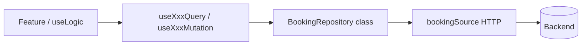

# Frontend Architecture Guide

**Версия:** 1.0 · май 2026  
**Назначение:** переносимый стандарт архитектуры React-приложений. Копируй этот файл в корень любого проекта и прикладывай к задаче для AI или нового разработчика.

**Связанные документы (опционально):**
- `FRONTEND_ARCHITECTURE_AUDIT.md` — детальный аудит эталонного проекта postfire (источник идей)
- `docs/frontend/templates/` — готовые файлы-шаблоны для копирования

---

## 1. Кратко: что мы делаем

Многослойная **feature-modular** архитектура для SPA (Vite + React Router или Next.js):

```
Route → Screen → Module (domain + feature) → shared UI
                      ↓
              data (source + repository + hooks)
```

**Ключевые принципы:**
- **OOP на data-слое** — Repository class оборачивает HTTP
- **React Query** — единственный кеш серверных данных (не MobX/Zustand для API)
- **react-hook-form** — значения форм
- **useState / Zustand** — только UI-only state (табы, wizard step, «диалог открыт»)
- **Barrel exports** — `index.ts` только re-export, без логики
- **Подфичи** — большая фича = папка с подпапками-компонентами + `useLogic`

---

## 2. Инструкция для AI (копируй в первое сообщение)

```text
Контекст: выравниваем фронтенд по FRONTEND_ARCHITECTURE_GUIDE.md.

Сделай:
1. Прочитай GUIDE целиком + заполненный PROJECT CONTEXT (§12).
2. Просканируй репозиторий: package.json, src/, роутинг, state, data layer.
3. Gap-analysis: что есть vs §3–§8, DoD §11.
4. План по фазам §13; реализация — эталоны §9 и docs/frontend/templates/.
5. Спорные решения — ADR (§14), не ломай без записи.

Правила state (§6):
- API data → React Query через repository hooks
- Forms → react-hook-form
- UI-only → useState или Zustand
- НЕ дублировать server data в store

Barrel index.ts — только re-export (§8).
```

---

## 3. Стек (гибкий)

| Категория | Рекомендация | Альтернативы |
|-----------|--------------|--------------|
| Framework | Vite + React 18/19 | Next.js App Router |
| Routing | React Router 7 | Next.js file routes |
| Server cache | TanStack Query 5 | — |
| Forms | react-hook-form + Zod/Valibot | — |
| HTTP | axios | fetch wrapper |
| UI-only state | useState → Zustand при росте | MobX только если команда уже на нём |
| UI kit | MUI (admin) / CSS Modules + tokens (mobile/mini app) | — |
| Types | shared package или `domain/types` | — |

**Не обязательно:** MobX, Next.js, i18n, Storybook — добавлять по необходимости проекта.

---

## 4. Дерево каталогов `src/`

```
src/
├── App.tsx                    # роутер, guards, providers
├── main.tsx                   # QueryClient, ThemeProvider, …
│
├── screens/                   # page-level composition (тонкие)
│   └── BookingScreen/
│       ├── index.ts           # export { BookingScreen } from './BookingScreen'
│       └── BookingScreen.tsx
│
├── modules/                   # бизнес-домены
│   └── booking/
│       ├── index.ts           # export * from './domain'; export * from './feature'
│       ├── domain/
│       │   ├── index.ts
│       │   ├── types.ts
│       │   ├── weeklyDraft.ts
│       │   └── apiError.ts
│       └── feature/
│           ├── index.ts
│           ├── BookingTabs/
│           │   ├── index.ts
│           │   ├── BookingTabs.tsx
│           │   └── useLogic.ts
│           ├── BookingServicesPanel/
│           │   ├── index.ts
│           │   ├── BookingServicesPanel.tsx
│           │   └── useLogic.ts
│           └── ServiceTypeFormDialog/
│               ├── index.ts
│               ├── ServiceTypeFormDialog.tsx
│               └── useLogic.ts
│
├── data/
│   ├── source/                # HTTP only, *NetworkDTO
│   │   ├── axiosInstance.ts
│   │   └── bookingSource.ts
│   └── repositories/
│       └── booking/
│           ├── index.ts
│           ├── BookingRepository.ts
│           ├── dto.ts
│           ├── queryKeys.ts
│           └── hooks/
│               ├── useBookingServiceTypesQuery.ts
│               ├── useCreateBookingServiceTypeMutation.ts
│               └── index.ts
│
└── shared/
    ├── index.ts               # optional barrel
    ├── config/                # env, http client helpers
    ├── constants/             # APP_ROUTES, cache lifetime
    ├── utils/                 # errorsService, formatters
    ├── hooks/                 # useToggle, useDialog
    └── ui/                    # Loader, ConfirmDialog, Layout, …
```

**Alias:** `@/` → `./src/` (настраивается в Vite/tsconfig).

---

## 5. Слои и ответственность

### 5.1. `screens/` — композиция страницы

- Обёртка Layout, title, analytics
- Импорт feature из `modules/`
- **Не содержит:** прямых вызовов API, сложных форм, query/mutation (передаём в feature)

```tsx
// screens/BookingScreen/BookingScreen.tsx
export function BookingScreen() {
  return (
    <Layout title="Запись">
      <BookingTabs />
    </Layout>
  );
}
```

### 5.2. `modules/{Name}/domain/` — чистая логика

- Types, constants, mappers, validators
- Pure functions / classes без React
- **Не импортирует:** React, components, hooks

### 5.3. `modules/{Name}/feature/` — UI подфичи

- Компоненты + co-located `useLogic.ts`
- Импортирует: свой `domain/`, `@/data/repositories/*/hooks`, `shared/`
- Большая фича → **несколько подпапок**, каждая со своим `useLogic`

### 5.4. `data/source/` — HTTP

- Только axios/fetch вызовы
- Типы `*NetworkDTO` (сырой контракт API)
- Без React, без toast, без UI-логики

### 5.5. `data/repositories/` — OOP + React Query

- **Class** unwrap `response.data`, map DTO
- **queryKeys.ts** — factory
- **hooks/** — thin wrappers над repository для React Query

### 5.6. `shared/` — инфраструктура

- UI kit, config, utils, constants
- **Не импортирует:** `modules/`, `screens/`

---

## 6. State management — главное правило

### 6.1. Таблица ответственности

| Что | Инструмент | Примеры |
|-----|------------|---------|
| Данные с API, кеш, списки, детали | **React Query** | `useBookingServiceTypesQuery` |
| Значения формы, touched, errors | **react-hook-form** в `useLogic` | диалог создания услуги |
| UI-only: tab, step, dialog open, draft до submit | **useState** или **Zustand** | активная вкладка, wizard step |
| Синхронизация после mutation | **RQ** `invalidateQueries` | не копировать ответ в store |

### 6.2. Запрещено

**Хранить одну сущность с API и в React Query, и в MobX/Zustand/local store «навсегда».**

Исключение: краткий optimistic UI до `onSuccess`.

### 6.3. Почему MobX + repository «ломался» на кешировании

Repository class — отличный слой. Проблема возникает, когда **ответ API кладётся в MobX store** вместо React Query:

- нет dedupe запросов между компонентами
- нет staleTime / background refetch из коробки
- invalidate после mutation — вручную, легко забыть

**Решение:** repository остаётся class; **кеш — только React Query**:

```
Component → useXxxQuery() → repository.method() → source → HTTP
```

MobX/Zustand — только если нужен сложный wizard или cross-component UI state без API.

---

## 7. Data layer — поток данных



### 7.1. Source

```ts
// data/source/bookingSource.ts
export type BookingServiceTypeNetworkDTO = { id: number; name: string; /* … */ };

export async function fetchBookingServiceTypes(): Promise<BookingServiceTypeNetworkDTO[]> {
  const { data } = await axiosInstance.get('/api/.../service-types');
  return data;
}
```

### 7.2. Repository (class)

```ts
// data/repositories/booking/BookingRepository.ts
class BookingRepository {
  async getServiceTypes(): Promise<BookingServiceTypeDTO[]> {
    const rows = await fetchBookingServiceTypes();
    return rows.map(mapServiceTypeFromNetwork);
  }

  async createServiceType(input: CreateServiceTypeInput): Promise<BookingServiceTypeDTO> {
    const row = await postBookingServiceType(input);
    return mapServiceTypeFromNetwork(row);
  }
}

export const bookingRepository = new BookingRepository();
```

### 7.3. Query keys (factory)

```ts
// data/repositories/booking/queryKeys.ts
export const bookingKeys = {
  all: ['booking'] as const,
  serviceTypes: () => [...bookingKeys.all, 'service-types'] as const,
  weekly: (serviceTypeId: number) => [...bookingKeys.all, 'weekly', serviceTypeId] as const,
};
```

### 7.4. React Query hook

```ts
// data/repositories/booking/hooks/useBookingServiceTypesQuery.ts
export function useBookingServiceTypesQuery() {
  return useQuery({
    queryKey: bookingKeys.serviceTypes(),
    queryFn: () => bookingRepository.getServiceTypes(),
    staleTime: DEFAULT_CACHE_LIFETIME_MS,
  });
}
```

### 7.5. Mutation hook

```ts
export function useCreateBookingServiceTypeMutation() {
  const qc = useQueryClient();
  return useMutation({
    mutationFn: (input: CreateServiceTypeInput) => bookingRepository.createServiceType(input),
    onSuccess: () => qc.invalidateQueries({ queryKey: bookingKeys.serviceTypes() }),
  });
}
```

**Hooks вызывают repository, не source напрямую.**

---

## 8. Barrel exports (`index.ts`)

### 8.1. Правило

`index.ts` — **только re-export**. Никогда не пиши JSX/логику в index.

### 8.2. Примеры

```ts
// modules/booking/feature/BookingServicesPanel/index.ts
export { BookingServicesPanel } from './BookingServicesPanel';

// modules/booking/feature/index.ts
export { BookingServicesPanel } from './BookingServicesPanel';
export { BookingSchedulePanel } from './BookingSchedulePanel';

// modules/booking/index.ts
export * from './domain';
export * from './feature';

// data/repositories/booking/index.ts
export { bookingRepository } from './BookingRepository';
export * from './hooks';
export { bookingKeys } from './queryKeys';
```

### 8.3. Именование файлов

| Сущность | Паттерн |
|----------|---------|
| Feature component | `BookingServicesPanel/BookingServicesPanel.tsx` |
| Logic hook | `useLogic.ts` или `useBookingServicesLogic.ts` |
| Repository | `BookingRepository.ts` |
| Query hook | `useBookingServiceTypesQuery.ts` |
| Source | `bookingSource.ts` |
| DTO source | `*NetworkDTO` |
| DTO domain | `*DTO` |

---

## 9. Feature component + useLogic (эталон)

### 9.1. Компонент — разметка

```tsx
// modules/booking/feature/BookingServicesPanel/BookingServicesPanel.tsx
export function BookingServicesPanel() {
  const logic = useBookingServicesLogic();

  if (logic.isLoading) return <Loader />;
  if (logic.isError) return <ErrorState message={logic.errorMessage} />;

  return (
    <>
      <PanelHeader onAdd={logic.openCreate} />
      <ServiceTypesTable items={logic.items} onEdit={logic.openEdit} onDelete={logic.confirmDelete} />
      <ServiceTypeFormDialog {...logic.dialog} />
      <ConfirmDialog {...logic.deleteDialog} />
    </>
  );
}
```

### 9.2. useLogic — presentation logic

```ts
// modules/booking/feature/BookingServicesPanel/useLogic.ts
export function useBookingServicesLogic() {
  const { notify } = useNotification();
  const { data = [], isLoading, isError, error } = useBookingServiceTypesQuery();
  const createMutation = useCreateBookingServiceTypeMutation();
  const [dialog, setDialog] = useState<DialogState>({ open: false, item: null });

  const openCreate = () => setDialog({ open: true, item: null });

  const handleSubmit = async (values: ServiceTypeFormValues) => {
    try {
      await createMutation.mutateAsync(values);
      setDialog({ open: false, item: null });
      notify('Услуга создана', 'success');
    } catch (e) {
      notify(getApiErrorMessage(e), 'error');
    }
  };

  return {
    items: data,
    isLoading,
    isError,
    errorMessage: getApiErrorMessage(error),
    dialog: { open: dialog.open, item: dialog.item, onClose: () => setDialog({ open: false, item: null }), onSubmit: handleSubmit },
    openCreate,
    /* … */
  };
}
```

**useLogic содержит:** RHF setup, mutations wiring, локальный UI state, notify, navigation.  
**useLogic не содержит:** прямых axios-вызовов — только repository hooks.

---

## 10. Границы импортов

| Слой | Может импортировать | Не может |
|------|---------------------|----------|
| `screens/` | `modules`, `shared` | `data/source` напрямую |
| `modules/feature/` | свой `domain`, `data/repositories`, `shared` | чужой `modules/*/domain` без причины |
| `modules/domain/` | `shared/utils`, types | React, hooks, components |
| `data/repositories/` | `data/source`, `shared` | `modules`, React (кроме hooks/) |
| `data/source/` | `shared/config` | `modules`, React |
| `shared/` | только `shared` | `modules`, `data`, `screens` |

Cross-module imports — редко; фиксировать в ADR.

---

## 11. Definition of Done — новая фича

- [ ] Модуль: `modules/{Name}/domain/` + `feature/` + barrels
- [ ] Screen (если новый route) — тонкий, только composition
- [ ] Source: `*NetworkDTO` + HTTP functions
- [ ] Repository class + `queryKeys` + hooks
- [ ] Feature: подпапки + `useLogic.ts` + `index.ts` re-exports
- [ ] State по таблице §6 (RQ / RHF / local)
- [ ] Route в `APP_ROUTES` (+ guard если protected)
- [ ] Ошибки через `getApiErrorMessage`, не hardcode «миграции»
- [ ] ADR если нарушены границы импортов

---

## 12. PROJECT CONTEXT (заполни для каждого проекта)

```markdown
### Проект
- Название: ___
- Приложения: admin | mini app | mobile (___)

### Окружение
- API URL env: VITE_API_URL | NEXT_PUBLIC_API_URL
- Auth: cookie | JWT header | Telegram initData
- Monorepo packages: @xxx/types, @xxx/api

### Backend contract
- Обёртка ответа: plain JSON | { data: T } | другое: ___
- Ошибки: { message } | { error: { code, message } } | другое: ___
- snake_case / camelCase в API: ___

### UI
- Admin: MUI v7 | другое
- Client app: CSS Modules + tokens | telegram-ui | другое

### State (override defaults)
- Zustand: да/нет, для: ___
- MobX: да/нет

### Миграция
- Текущий долг: (плоский src / queries в screens / …)
- Стратегия: big-bang | по модулю
- Пилот-модуль: booking | auth | ___

### Ограничения
- Не трогать: ___
- Сроки: ___
```

---

## 13. Roadmap миграции legacy → target

| Фаза | Задачи | Критерий готовности |
|------|--------|---------------------|
| **0** | GUIDE в репо, PROJECT CONTEXT, `@/` alias, `APP_ROUTES` | Документ + ADR-001 |
| **1** | Data layer на пилот-модуле: source → repository → hooks | Feature импортирует hooks, не source |
| **2** | Feature: подпапки + useLogic + barrels | Нет монолитов >200 строк в одном файле |
| **3** | Screens: вычистить queries/mutations в feature | Screen ≤30 строк composition |
| **4** | shared: `getApiErrorMessage`, constants, optional Storybook | Единый toast для сетевых ошибок |
| **5** | Остальные модули по одному PR | CI green, dead code удалён |

**Стратегия:** по модулю, не big-bang. Новый код — сразу по GUIDE; старый — при задаче в модуле.

---

## 14. ADR — журнал решений

Завести `docs/adr/NNN-title.md`:

```markdown
# ADR-NNN: Заголовок
- Status: proposed | accepted | deprecated
- Date: YYYY-MM-DD

## Context
## Decision
## Consequences
```

**Стартовый backlog:**

| ID | Тема |
|----|------|
| ADR-001 | React Query vs local/MobX/Zustand (§6) |
| ADR-002 | Hooks → repository, не source |
| ADR-003 | MUI vs CSS Modules primary |
| ADR-004 | Cross-module imports — когда допустимы |
| ADR-005 | Zustand для wizard vs useState |

---

## 15. Zustand для wizard (опционально)

Когда wizard >3 шагов или state нужен в нескольких подфичах без prop drilling:

```ts
// modules/booking/domain/bookingWizardStore.ts
import { create } from 'zustand';

type BookingWizardState = {
  step: 1 | 2 | 3;
  serviceTypeId: number | null;
  selectedDate: string | null;
  setStep: (step: 1 | 2 | 3) => void;
  setServiceTypeId: (id: number) => void;
  setSelectedDate: (date: string) => void;
  reset: () => void;
};

export const useBookingWizardStore = create<BookingWizardState>((set) => ({
  step: 1,
  serviceTypeId: null,
  selectedDate: null,
  setStep: (step) => set({ step }),
  setServiceTypeId: (serviceTypeId) => set({ serviceTypeId }),
  setSelectedDate: (selectedDate) => set({ selectedDate }),
  reset: () => set({ step: 1, serviceTypeId: null, selectedDate: null }),
}));
```

**Не хранить в wizard store:** списки услуг, availability с API — только RQ.

OOP внутри Zustand (class instance) — возможно, но обычно избыточно; functional store достаточно.

---

## 16. APP_ROUTES

```ts
// shared/constants/routes.ts
export const APP_ROUTES = {
  login: { path: '/login' },
  booking: {
    path: '/booking',
    tab: (tab: 'services' | 'schedule' | 'requests' | 'settings') =>
      `/booking?tab=${tab}`,
  },
  animals: { path: '/animals' },
} as const;
```

Guards (ProtectedRoute, role redirects) — рядом с router в `App.tsx`, маршруты — из `APP_ROUTES`.

---

## 17. Shared utils

```ts
// shared/utils/apiError.ts
import { isAxiosError } from 'axios';

export function getApiErrorMessage(error: unknown, fallback = 'Ошибка сервера'): string {
  if (isAxiosError(error)) {
    const data = error.response?.data;
    if (typeof data === 'string') return data;
    if (data && typeof data === 'object' && 'error' in data) {
      const err = (data as { error: unknown }).error;
      if (typeof err === 'string') return err;
      if (err && typeof err === 'object' && 'message' in err) {
        return String((err as { message: unknown }).message);
      }
    }
    if (data && typeof data === 'object' && 'message' in data) {
      return String((data as { message: unknown }).message);
    }
  }
  if (error instanceof Error) return error.message;
  return fallback;
}
```

```ts
// shared/constants/cache.ts
export const DEFAULT_CACHE_LIFETIME_MS = 30_000;
```

---

## 18. Что приложить к задаче

| Обязательно | Опционально |
|-------------|-------------|
| `FRONTEND_ARCHITECTURE_GUIDE.md` | `FRONTEND_ARCHITECTURE_AUDIT.md` (reference project) |
| Заполненный §12 PROJECT CONTEXT | `docs/frontend/templates/` |
| Название пилот-модуля | Swagger / OpenAPI |
| Ограничения («не трогать X») | Существующие ADR |

---

## 19. Парсинг для AI — не проблема

Barrel `index.ts` с re-export **не мешает** AI и людям, если:

- папки названы по компоненту (`BookingServicesPanel/BookingServicesPanel.tsx`)
- логика не в index, а в named files
- нет монолитов на 400+ строк

**Хуже barrels:** index с JSX/логикой, `api/index.ts` на 200 строк types+fetch, flat `src/` без модулей.

---

## 20. Приложение A — PROJECT CONTEXT: YouVet (пример)

```markdown
### Проект
- Название: YouVet
- Приложения: apps/admin (MUI), apps/app (Telegram Mini App)

### Окружение
- API: VITE_API_URL
- Admin auth: httpOnly cookie, withCredentials
- Mini App auth: X-Telegram-Init-Data + Authorization: tma
- Monorepo: @you-vet/types

### Backend contract
- Обёртка: plain JSON (массив/объект напрямую)
- Ошибки: текст или JSON message
- snake_case в API

### UI
- Admin: MUI v7, mobile-first < sm
- Mini App: CSS Modules + tokens.css, telegram-ui точечно

### State
- Zustand: опционально для C1 booking wizard
- MobX: нет

### Миграция
- Долг: queries в screens/panels, data/source без repositories, flat app/
- Стратегия: по модулю
- Пилот: admin/booking → app/booking (C1)

### Ограничения
- Не менять Go API без задачи
- Admin эталон mobile: BookingScreen, GroomingScreen
```

---

## 21. Приложение B — карта эталонных файлов

| Назначение | Шаблон |
|------------|--------|
| Source HTTP | `docs/frontend/templates/bookingSource.template.ts` |
| Repository class | `docs/frontend/templates/BookingRepository.template.ts` |
| Query keys | `docs/frontend/templates/queryKeys.template.ts` |
| Query hook | `docs/frontend/templates/useBookingServiceTypesQuery.template.ts` |
| Mutation hook | `docs/frontend/templates/useCreateBookingServiceTypeMutation.template.ts` |
| Feature + useLogic | `docs/frontend/templates/BookingServicesPanel.template/` |
| Screen | `docs/frontend/templates/BookingScreen.template/` |
| Module barrels | `docs/frontend/templates/module-index.template.ts` |

---

*Версия 1.0 — синтез postfire audit + YouVet; переносимый между проектами.*
