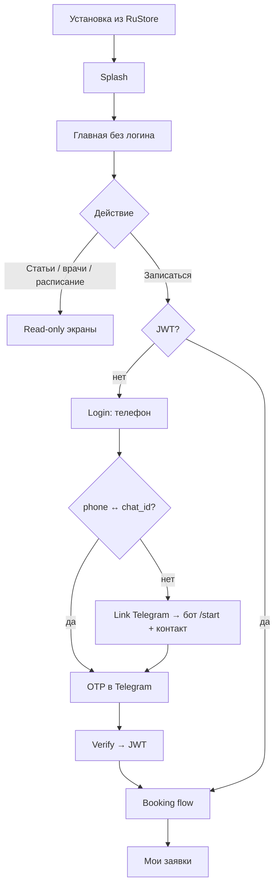

# Mobile App — проектирование MVP (RuStore v1)

> Статус: проектирование · Обновлено: 2026-06-09  
> Предшественники: [overview.md](./overview.md) · [research.md](./research.md) · [roadmap.md](./roadmap.md)

Документ проходит **7 шагов проектирования** по порядку. Решения помечены **✅ решено** (на основе текущего продукта) или **❓ открыто** (нужно подтверждение).

---

## 1. Scope MVP для RuStore

### 1.1 Цель релиза

**RuStore v1** — полноценное Android-приложение клиники (сейчас `default` / VPract), **не зависящее от Telegram** для просмотра контента и записи. Mini App и бот остаются параллельным каналом.

### 1.2 Что входит / не входит

| Область | RuStore v1.0 | v1.1 (сразу после) | Не в scope |
|---|---|---|---|
| Backend M0 | ✅ mobile API + auth | — | — |
| Контент read-only | ✅ parity с Mini App | — | — |
| Запись на приём | ✅ auth + booking flow | push о статусе заявки | — |
| Груминг | ✅ read-only (breeds + schedule) | — | онлайн-запись на груминг |
| «Задать вопрос» | ❌ | ✅ (нужен привязанный TG) | — |
| Push (FCM) | ❌ | ✅ | — |
| Карточка клиента (штрихкод) | ❌ | ❌ | PRD-09, фаза 8 |
| SMS OTP | ❌ | ❌ | M4 |
| iOS / App Store | ❌ | исследование | после стабилизации Android |
| Multi-clinic в одном APK | ❌ | ❌ | white-label / отдельные сборки |

**Обоснование v1.0 без read-only-only:** чисто «брошюра» слабо мотивирует установку из RuStore и повышает риск отклонения как «web wrapper». **Запись** — ключевая ценность; бэкенд фазы 5 уже есть. **Вопросы** исключены из v1.0: ответ идёт в Telegram — UX запутан без гарантии привязки; проще в v1.1 после стабильного auth.

### 1.3 Фазы roadmap ↔ релиз

```
M0 (backend)  ──┐
M1 (shell UI)   ├── RuStore v1.0 (internal → closed beta → production)
M2 (auth+booking)┘
M2.1 (push)     ── RuStore v1.1
M2.2 (questions)── RuStore v1.1–v1.2
M3 (store ops)  ── параллельно v1.0 (иконка, privacy, скриншоты)
```

### 1.4 Оценка сроков (1 разработчик, после фазы 5 на prod)

| Этап | Срок |
|---|---|
| M0 backend | 1–2 нед |
| M1 Capacitor + read-only экраны | 2–3 нед |
| M2 auth + booking (порт логики из `apps/app`) | 2 нед |
| M3 RuStore (материалы + первая публикация) | 1–2 нед |
| **Итого до RuStore v1.0** | **~6–9 нед** |

### 1.5 Решения продукта ✅ (2026-06-09)

| # | Решение |
|---|---|
| Q1 | Название в RuStore и на иконке: **Ветпрактика** |
| Q2 | **Запись в v1.0** — обязательна |
| Q3 | **1 клиника на сборку**; multi-tenant не в v1, закладки — см. [multi-tenant-notes.md](./multi-tenant-notes.md) |

### 1.6 App ID ✅

| Поле | Значение |
|---|---|
| `appId` | `ru.snzbeachvolleyball25.vetpraktika` |
| `appName` | `Ветпрактика` |

Обучающий справочник: [app-id-and-stores.md](./app-id-and-stores.md).

### 1.7 Допущения

- **Slug в сборке:** `VITE_CLINIC_SLUG=default` (как Mini App).
- **Брендинг в сторе:** «Ветпрактика»; контент (лого, телефон) — из `clinic-info`.
- **Уведомления о заявках в v1.0:** через привязанный Telegram-бот (после auth), не FCM.

---

## 2. Information Architecture и экраны

### 2.1 Навигация верхнего уровня

**Паттерн:** single-stack + **bottom tab bar** (4 вкладки) + modal/sub-routes для деталей.

Отличие от Mini App: нет Telegram BackButton — своя шапка «‹ Назад» на вложенных экранах (как `NavList` в Mini App).

```
┌─────────────────────────────────────┐
│  [AppBar: клиника / заголовок]      │
├─────────────────────────────────────┤
│                                     │
│           Screen content            │
│                                     │
├─────────────────────────────────────┤
│  🏠 Главная │ 📅 Запись │ 📚 Статьи │ ⋯ Ещё │
└─────────────────────────────────────┘
```

| Tab | Корень | Содержание |
|---|---|---|
| **Главная** | `/` | Hero, NavGrid-аналог, «Сегодня в клинике», featured, sticky «Позвонить» |
| **Запись** | `/booking` | Хаб записи (как Mini App) или redirect на login |
| **Статьи** | `/animals` | Список животных → статьи → статья |
| **Ещё** | `/more` | Врачи, расписание, груминг, настройки, о приложении |

**Почему не 1:1 NavGrid-only:** bottom tabs — ожидаемый паттерн в RuStore; запись и статьи — топ сценарии.

### 2.2 Полная карта экранов

| ID | Route | Экран | Auth | Parity Mini App |
|---|---|---|---|---|
| S00 | `/splash` | Splash + bootstrap (clinic-info, tokens) | — | новый |
| S01 | `/` | Home | — | `HomeScreen` |
| S02 | `/animals` | Список животных | — | `AnimalsScreen` |
| S03 | `/animals/:slug/articles` | Статьи животного | — | `ArticlesScreen` |
| S04 | `/articles/:slug` | Статья (HTML) | — | `ArticleScreen` |
| S05 | `/doctors` | Список врачей | — | `DoctorsScreen` |
| S06 | `/doctors/:id` | Карточка врача | — | `DoctorScreen` |
| S07 | `/schedule` | Расписание | — | `ScheduleScreen` |
| S08 | `/grooming` | Груминг хаб | — | `GroomingScreen` |
| S09 | `/grooming/breeds` | Услуги и породы | — | `GroomingBreedsScreen` |
| S10 | `/grooming/schedule` | График груминга | — | `GroomingScheduleScreen` |
| S11 | `/more` | Меню «Ещё» | — | новый (агрегатор) |
| S12 | `/booking` | Хаб записи | soft¹ | `BookingScreen` |
| S13 | `/booking/new` | Выбор услуги | ✅ | `BookingServicesScreen` |
| S14 | `/booking/new/:id/date` | Выбор даты/слота | ✅ | `BookingDateScreen` |
| S15 | `/booking/new/:id/date/:date` | Форма заявки | ✅ | `BookingFormScreen` |
| S16 | `/booking/requests` | Мои заявки | ✅ | `BookingRequestsScreen` |
| S17 | `/auth/login` | Ввод телефона | — | новый |
| S18 | `/auth/verify` | Ввод кода | — | новый |
| S19 | `/auth/link-telegram` | Onboarding привязки TG | — | новый |
| S20 | `/settings` | Профиль, выход, версия | opt | новый |

¹ **Soft gate:** `/booking` виден всем; CTA «Новая заявка» / «Мои заявки» ведут на login если нет JWT.

**Не в v1.0:** `/question` (QuestionScreen).

### 2.3 User flows (основные)



### 2.4 Deep links (задел)

| Link | Назначение |
|---|---|
| `youvet://booking` | Tab запись |
| `youvet://articles/:slug` | Статья (баннер, push v1.1) |
| `https://app…/open?…` | App Links позже |

Capacitor: [@capacitor/app](https://capacitorjs.com/docs/apis/app) URL open.

### 2.5 Состояния и edge cases

| Ситуация | Поведение |
|---|---|
| Нет сети | Banner «Нет интернета»; кэш последнего `clinic-info` (AsyncStorage) |
| Груминг пустой | Скрыть раздел (как `GroomingGuard`) |
| Запись выключена | Скрыть tab «Запись» или empty state |
| 401 на protected route | Redirect `/auth/login` + return URL |
| Пользователь без Telegram | Экран «Привяжите Telegram» + кнопка открыть бота; SMS — не в v1 |

---

## 3. UI-kit

### 3.1 Принципы

- **Не** `@telegram-apps/telegram-ui` — нативный для TG, не для Capacitor.
- **Да** design tokens из `apps/app/src/styles/tokens.css` — фирменный зелёный, знакомый клиентам клиники.
- **Да** собственные примитивы в `apps/mobile/src/ui/` — лёгкие, без MUI (MUI тяжёлый для mobile WebView).
- Ориентир по плотности: Mini App (`--vet-page-padding: 16px`, `--vet-content-max: 303px` → на mobile **100% ширины**, max-width только на tablet).

### 3.2 Тема (светлая / тёмная)

Mini App завязан на `--tg-theme-*`. Mobile:

```css
/* apps/mobile/src/styles/tokens.css */
:root {
  /* копия vet-* из apps/app без tg-theme fallback на зелёный */
  --vet-bg: #ffffff;
  --vet-bg-secondary: #f5f5f5;
  --vet-text-body: #1a1a1a;
  /* … остальные --vet-* … */
}
:root[data-theme='dark'] {
  --vet-bg: #121212;
  --vet-bg-secondary: #1e1e1e;
  /* аналог :root[data-tg-theme='dark'] */
}
```

Переключение: `prefers-color-scheme` + ручной toggle в Settings (опционально v1.1).

### 3.3 Компоненты (v1)

| Компонент | Назначение | Аналог в Mini App |
|---|---|---|
| `AppShell` | Safe area, status bar, tab bar | `AppLayout` |
| `AppBar` | Заголовок + back | `AppHeader` / NavList header |
| `TabBar` | 4 вкладки | — |
| `NavCard` | Плитка меню | `NavGrid` item |
| `NavList` / `NavRow` | Список с иконкой | `NavList` |
| `Button` | primary / secondary / ghost | telegram `Button` |
| `TextField` | телефон, код, форма записи | TMA inputs |
| `PhoneField` | маска `+7` | `phoneMask.ts` |
| `Card` | контентные блоки | CSS modules в app |
| `Chip` / `Badge` | статус заявки | booking labels |
| `DoctorAvatar` | фото врача | портировать |
| `HtmlContent` | статья (sanitize) | `ArticleScreen` |
| `EmptyState` | нет данных | — |
| `ErrorState` | ошибка + retry | — |
| `Skeleton` | загрузка | NavGrid skeleton |
| `Spinner` | fullscreen load | `Preloader` |
| `StickyCallBar` | «Позвонить» | Home sticky |
| `Banner` | clinic banner | Home banner |

### 3.4 Иконки

Портировать SVG из `apps/app/src/components/NavGrid/icons.tsx` (уже inline, без Dreamstime).

### 3.5 Типографика

| Token | Size | Use |
|---|---|---|
| `title-lg` | 22px/600 | Hero название клиники |
| `title-md` | 18px/600 | Section headings |
| `body` | 16px/400 | Основной текст |
| `caption` | 13px/400 | Subtitles в NavCard |
| `label` | 12px/500 | Chips, tabs |

Шрифт: **system-ui** (Roboto на Android) — без кастомных webfonts в v1.

### 3.6 Shared code с `apps/app`

| Шарить (extract → `packages/` или copy) | Не шарить |
|---|---|
| `domain/booking/*` (rules, timeSlots, labels) | telegram-ui компоненты |
| `utils/phoneMask.ts`, `apiError.ts` | `telegramInitData`, haptic |
| DTO из `@you-vet/types` | `BackButtonHandler` |
| hooks: `useBookingAvailable`, `useGroomingAvailable` | `TelegramOnlyScreen` |

**Рекомендация:** в M1 создать `packages/client-api` с axios factory (baseURL + auth interceptor) — Mini App и Mobile передают разные auth strategies.

---

## 4. Auth UX

### 4.1 Модель

Два уровня (из [research.md](./research.md)):

1. **Публичный доступ** — GET контент без JWT; rate limit по IP.
2. **Пользователь** — JWT после OTP; нужен для POST booking, list/cancel requests.

### 4.2 Первичная привязка Telegram (обязательна для OTP)

```
┌──────────────────────────────────────────┐
│  Чтобы войти, привяжите Telegram         │
│                                          │
│  1. Откройте @VPract_bot                 │
│  2. Нажмите /start                       │
│  3. «Поделиться номером телефона»        │
│                                          │
│  [ Открыть Telegram ]  [ Уже сделал ]    │
└──────────────────────────────────────────┘
```

`Открыть Telegram` → `https://t.me/VPract_bot?start=link` (Capacitor Browser / App plugin).

После возврата в app → экран ввода телефона.

### 4.3 Login flow

```
/auth/login
  → ввод +7XXXXXXXXXX
  → POST /api/mobile/v1/auth/request { phone }
  → если 404 PHONE_NOT_LINKED → /auth/link-telegram
  → если 200 → /auth/verify

/auth/verify
  → 6 цифр, auto-submit
  → POST /api/mobile/v1/auth/verify { phone, code }
  → store tokens (Capacitor Preferences, encrypted)
  → redirect на returnUrl (booking)
```

### 4.4 Хранение токенов

| Key | Storage | Содержимое |
|---|---|---|
| `access_token` | `@capacitor/preferences` | JWT, TTL ~15 min |
| `refresh_token` | Preferences | opaque, TTL ~30 d |
| `phone` | Preferences | маскированный для UI |

Interceptor: 401 → `POST /auth/refresh` → retry; fail → logout.

**Не** localStorage (SEC-04 урок для admin).

### 4.5 Logout / смена аккаунта

Settings → «Выйти» → clear Preferences → `/`.

### 4.6 Связь с `telegram_users`

Существующая таблица `telegram_users` (из initData) + новая `mobile_users` или расширение:

- `phone` UNIQUE
- `telegram_chat_id` NULLABLE до привязки
- `linked_at`

Bot handler `contact` обновляет связку (M0).

---

## 5. RuStore checklist (v1.0)

### 5.1 Аккаунт и юридическое

- [ ] Аккаунт разработчика RuStore ([help/developers](https://www.rustore.ru/help/developers))
- [ ] Юрлицо / ИП, совпадающее с клиникой или подрядчик
- [ ] **Политика конфиденциальности** URL (обработка телефона, ФИО питомца, Telegram chat_id)
- [ ] Пользовательское соглашение (опционально, можно объединить)
- [ ] Согласие на ПДн в форме записи (чекбокс, текст как в Mini App)

### 5.2 Материалы листинга

| Ассет | Spec |
|---|---|
| Иконка | 512×512 PNG, adaptive icon foreground/background |
| Feature graphic | 1024×500 (если требуется) |
| Скриншоты | min 2, phone 9:16 — главная, запись, статья, врачи |
| Краткое описание | до 80 символов |
| Полное описание | функции: статьи, врачи, запись, расписание |
| Категория | «Здоровье» / «Медицина» |
| Возрастной рейтинг | 0+ / 6+ (нет тревожного контента) |
| Контакты поддержки | email / телефон клиники |

### 5.3 Технические требования

- [ ] `targetSdk` актуальный (Android 14+)
- [ ] Подпись APK/AAB (upload key + app signing)
- [ ] `android:exported` audit для deep links
- [ ] Permissions: **INTERNET**; не запрашивать лишние (камера — не в v1)
- [ ] Privacy manifest: какие данные собираются (телефон, имя, питомец)
- [ ] ProGuard/R8 для release build
- [ ] Тест на RuStore pre-production / internal testing track

### 5.4 Снижение риска «web wrapper»

- Native splash (`@capacitor/splash-screen`)
- Status bar styling (`@capacitor/status-bar`)
- `tel:` и geo intent на адрес клиники
- Bottom navigation + auth flow
- v1.1: push notifications

### 5.5 CI (M3)

Workflow `mobile-build.yml`:

```yaml
# триггер: paths apps/mobile/**, manual
# jobs: npm ci → turbo build mobile → gradle assembleRelease → artifact APK/AAB
```

Загрузка в RuStore — вручную в v1.0; API RuStore — автоматизация позже.

---

## 6. API-контракт M0

Префикс: **`/api/mobile/v1`**. JSON, UTF-8. Ошибки: `{ "error": "CODE", "message": "…" }`.

### 6.1 Auth (новое)

| Method | Path | Body | Response | Auth |
|---|---|---|---|---|
| POST | `/auth/request` | `{ "phone": "+79…" }` | `{ "expires_in": 300 }` | — |
| POST | `/auth/verify` | `{ "phone", "code" }` | `{ "access_token", "refresh_token", "expires_in" }` | — |
| POST | `/auth/refresh` | `{ "refresh_token" }` | новая пара токенов | — |
| POST | `/auth/logout` | `{ "refresh_token" }` | 204 | opt |

**Коды ошибок auth:**

| HTTP | error | Когда |
|---|---|---|
| 404 | `PHONE_NOT_LINKED` | нет `phone ↔ chat_id` |
| 429 | `RATE_LIMIT` | слишком частые request |
| 401 | `INVALID_CODE` | неверный/истёкший OTP |
| 400 | `INVALID_PHONE` | формат |

### 6.2 Clinics — read (без initData)

Те же response body, что `/api/clinics/{slug}/…` сегодня. Handlers **переиспользуются**; middleware — `OptionalMobileJWT` или публичный rate limit.

| Method | Path | Mini App аналог |
|---|---|---|
| GET | `/clinics/{slug}/clinic-info` | ✅ |
| GET | `/clinics/{slug}/animals` | ✅ |
| GET | `/clinics/{slug}/articles/featured` | ✅ |
| GET | `/clinics/{slug}/animals/{animalSlug}/articles` | ✅ |
| GET | `/clinics/{slug}/articles/{articleSlug}` | ✅ |
| GET | `/clinics/{slug}/doctors` | ✅ |
| GET | `/clinics/{slug}/schedule` | ✅ |
| GET | `/clinics/{slug}/grooming/breeds` | ✅ |
| GET | `/clinics/{slug}/grooming/schedule` | ✅ |
| GET | `/clinics/{slug}/booking/service-types` | ✅ |
| GET | `/clinics/{slug}/booking/availability?service_type_id=` | ✅ |

### 6.3 Clinics — write (JWT required)

| Method | Path | Mini App аналог |
|---|---|---|
| GET | `/clinics/{slug}/booking/requests` | list my |
| POST | `/clinics/{slug}/booking/requests` | create |
| PATCH | `/clinics/{slug}/booking/requests/{id}` | cancel |

Идентификация пользователя: `sub` в JWT = `mobile_user_id`; handler мапит на `telegram_user_id` или напрямую на phone для заявок (решение при M0: **единый `client_identity`** в booking — phone из JWT).

### 6.4 Rate limits

| Group | Limit |
|---|---|
| Public GET | 120 req/min per IP |
| POST auth/request | 3/min per phone, 10/min per IP |
| POST auth/verify | 10/min per phone |
| Authenticated | 60 req/min per user |

### 6.5 Bot (M0)

| Event | Действие |
|---|---|
| `/start` | приветствие + кнопка request_contact |
| `message.contact` | upsert `phone ↔ chat_id`, ответ «Готово, вернитесь в приложение» |
| auth request | `SendMessage(chat_id, "Код: 123456")` |

### 6.6 Миграции

```sql
-- mobile_users
CREATE TABLE mobile_users (
  id BIGSERIAL PRIMARY KEY,
  phone TEXT NOT NULL UNIQUE,
  telegram_chat_id BIGINT,
  created_at TIMESTAMPTZ NOT NULL DEFAULT now(),
  linked_at TIMESTAMPTZ
);

-- auth_codes
CREATE TABLE auth_codes (
  id BIGSERIAL PRIMARY KEY,
  phone TEXT NOT NULL,
  code_hash TEXT NOT NULL,
  expires_at TIMESTAMPTZ NOT NULL,
  created_at TIMESTAMPTZ NOT NULL DEFAULT now()
);
CREATE INDEX auth_codes_phone_expires ON auth_codes (phone, expires_at);
```

JWT: отдельный `JWT_MOBILE_SECRET`, claims `{ sub, phone, iat, exp }`.

---

## 7. Структура `apps/mobile`

### 7.1 Дерево каталогов

```
apps/mobile/
  package.json
  vite.config.ts
  capacitor.config.ts
  tsconfig.json
  index.html
  android/                 # cap add android (в git)
  ios/                     # cap add ios (задел, не в RuStore v1)
  public/
    icons/
  src/
    main.tsx
    App.tsx
    routes.tsx
    api/
      client.ts            # axios + interceptors
      endpoints.ts         # thin wrappers (из packages/client-api позже)
    auth/
      AuthContext.tsx
      tokenStorage.ts
      useAuth.ts
    screens/
      SplashScreen.tsx
      HomeScreen.tsx
      …                    # mirror apps/app/screens
      auth/
        LoginScreen.tsx
        VerifyScreen.tsx
        LinkTelegramScreen.tsx
      booking/
        …
    components/
      shell/
        AppShell.tsx
        TabBar.tsx
        AppBar.tsx
      …
    ui/                    # design system primitives
      Button.tsx
      TextField.tsx
      …
    hooks/
    domain/                # copy or import from shared package
    styles/
      tokens.css
      global.css
    utils/
.env.example
```

### 7.2 `package.json` (черновик)

```json
{
  "name": "@you-vet/mobile",
  "private": true,
  "scripts": {
    "dev": "vite",
    "build": "tsc -b && vite build",
    "lint": "eslint .",
    "cap:sync": "npm run build && npx cap sync",
    "cap:android": "npx cap open android"
  },
  "dependencies": {
    "@capacitor/android": "^7.x",
    "@capacitor/app": "^7.x",
    "@capacitor/core": "^7.x",
    "@capacitor/preferences": "^7.x",
    "@capacitor/splash-screen": "^7.x",
    "@capacitor/status-bar": "^7.x",
    "@tanstack/react-query": "^5.x",
    "@you-vet/types": "*",
    "axios": "^1.x",
    "react": "^18.3.1",
    "react-dom": "^18.3.1",
    "react-router-dom": "^6.x"
  },
  "devDependencies": {
    "@capacitor/cli": "^7.x",
    "@vitejs/plugin-react": "^6.x",
    "typescript": "~5.9.x",
    "vite": "^8.x"
  }
}
```

### 7.3 `capacitor.config.ts`

```ts
import type { CapacitorConfig } from '@capacitor/cli';

const config: CapacitorConfig = {
  appId: 'ru.snzbeachvolleyball25.vetpraktika',
  appName: 'Ветпрактика',
  webDir: 'dist',
  server: { androidScheme: 'https' },
};

export default config;
```

### 7.4 Env

| Variable | Пример | Назначение |
|---|---|---|
| `VITE_API_URL` | `https://api.bospur.ru` | API host |
| `VITE_CLINIC_SLUG` | `default` | Клиника |
| `VITE_BOT_USERNAME` | `VPract_bot` | Deep link |
| `VITE_MOBILE_API_PREFIX` | `/api/mobile/v1` | Префикс |

### 7.5 Turborepo

`apps/mobile` автоматически в `workspaces: ["apps/*"]`. Добавить в `turbo.json`:

```json
"build": {
  "dependsOn": ["^build"],
  "outputs": ["dist/**"]
}
```

Отдельный deploy: **не** `deploy-app.yml` (это Mini App SPA). Позже `mobile-build.yml`.

### 7.6 Порядок реализации (после утверждения дизайна)

1. Scaffold `apps/mobile` + Capacitor Android
2. M0 на server (параллельно)
3. Shell + tokens + Home read-only
4. Остальные read-only экраны
5. Auth screens + M0 integration
6. Booking port
7. RuStore materials + internal APK

---

## Следующий документ

- [x] [screen-specs.md](./screen-specs.md) — wireframe каждого экрана (поля, кнопки, API)
- [ ] Scaffold `apps/mobile` + M0 backend
- [ ] `портал` → синхрон `html/mobile.html` с screen-specs (по команде)

---

## Changelog

| Дата | Изменение |
|---|---|
| 2026-06-09 | Первая версия: scope, IA, UI-kit, auth, RuStore, API M0, структура monorepo |
| 2026-06-09 | Утверждено: Ветпрактика, запись в v1, appId `ru.snzbeachvolleyball25.vetpraktika` |
